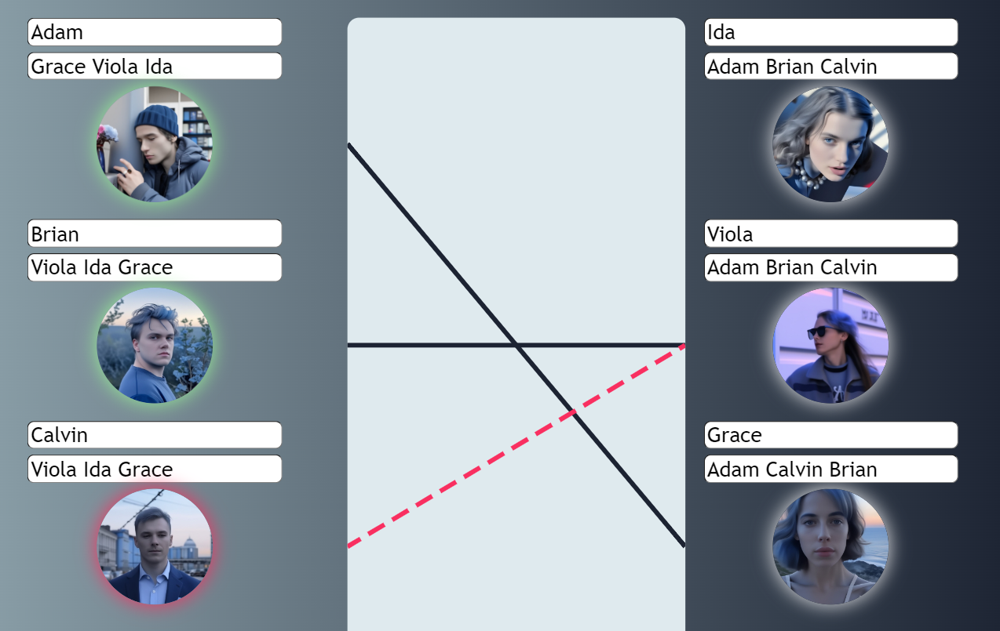

  <h1 align="center">алгоритм Гэйла — Шепли</h1>

<!-- TABLE OF CONTENTS -->

  
Содержание

  <ol>
    <li>
      <a href="#about-the-project">О проекте</a>
    </li>
    <li>
      <a href="#getting-started">Getting Started</a>
    </li>
    <li>
      <a href="#usage">Использование</a>
    </li>
    <li>
      <a href="#architecture">Архитектура</a>
    </li>
    <li>
      <a href="#contact">Контакты</a>
    </li>
  </ol>

<!-- ABOUT THE PROJECT -->
<h2 id="about-the-project">О проекте</h2>

Web-приложение симулирует работу [алгоритма Гэйла — Шепли](https://ru.wikipedia.org/wiki/%D0%90%D0%BB%D0%B3%D0%BE%D1%80%D0%B8%D1%82%D0%BC_%D0%93%D1%8D%D0%B9%D0%BB%D0%B0_%E2%80%94_%D0%A8%D0%B5%D0%BF%D0%BB%D0%B8), предназначенного для поиска стабильных паросочетаний (мэтчингов).

Всего есть две стороны - предлагающая и принимающая. По умолчанию будем считать, что мужчины делают предложение женщинам, однако в общем случае стороны могут поменяться местами, а также роли могут быть другими - вузы и студенты, например.

-------------
Алгоритм заключается в следующем: каждый мужчина делает предложение первой женщине в своём списке. Каждая женщина отвечает «может быть» своему поклоннику, которого она предпочитает больше всего, и «нет» всем остальным женихам. Затем она временно «обручена» с женихом, которого она до сих пор предпочитает больше всего, и этот жених также временно обручен с ней.

В каждом последующем раунде сначала каждый незанятый мужчина делает предложение наиболее предпочтительной женщине, которой он еще не сделал предложение (независимо от того, обручена ли женщина). Затем каждая женщина отвечает «возможно», если она в настоящее время не помолвлена или если она предпочитает этого мужчину своему нынешнему временному партнеру (в этом случае она отвергает своего нынешнего временного партнера, который становится незанятым). Временный характер помолвки сохраняет право уже обрученной женщины «бросить» своего бывшего партнера.

Этот процесс повторяется до тех пор, пока все не будут задействованы.

--------------------

(<a href="#readme-top">back to top</a>)

<!-- GETTING STARTED -->
<h2 id="#getting-started">Getting Started</h2>
Сборка и развертывание реализованы с использованием `Github pages`: [matching_app](avo-milas.github.io/matching_app/)

(<a href="#readme-top">back to top</a>)

<!-- USAGE EXAMPLES -->
<h2 id="usage">Использование</h2>

- Ознакомиться с описанием работы и основных функций можно, нажав на <i>иконку информации</i> на главном меню:

- В левой части экрана можно ознакомиться с <i>текстовым</i> описанием работы алгоритма.

Запуск по шагам:

Контейнер с результатами:

- В правой части экрана - <i>визуализация</i>:

(<a href="#readme-top">back to top</a>)

<!-- Architecture -->
<h2 id="architecture">Архитектура</h2>

1. Основные функции:

  - Функции визуализации:
   
      - `showConnectionLine(manIndex, womanIndex, stepIndex)`: отображает линию соединения между мужчиной и женщиной на основе текущего шага алгоритма. Устанавливает координаты линии, цвет, стиль и анимацию.
      - `clearConnectionLines()`: удаляет все линии соединения на экране.
      - `deleteConnectionLine(line_id)`: удаляет конкретную линию соединения по её ID.
      - `createCircles(type, startCnt, endCnt)`: создает иконки для мужчин и женщин, используя фотографии или обезличенные иконки.
      - `displayPairs(pairs)`: отображает таблицу с результатами после выполнения алгоритма.
      
  - Функции инициализации и сброса:
  
    - `resetAlgorithm()`: очищает текущее состояние и готовит новые параметры для запуска алгоритма. Перемешивает массивы фотографий и создаёт иконки для мужчин и женщин.
    - `clearResults()`: очищает контейнер с результатами и сбрасывает стили иконок.

  - Алгоритм Гейла-Шепли:
  
    - `isEngaged(woman, stablePairs)`: проверяет, занята ли женщина на текущий момент.
    - `galeShapleyWithSteps(menPrefs, womenPrefs)`: запускает алгоритм Гейла-Шепли по шагам - выполняет итерации, в которых мужчины делают предложения, а женщины выбирают из них лучшие варианты. Возвращает пары, шаги алгоритма и промежуточные состояния.
    
  - Функции запуска алгоритма:
  
    - `runAlgorithm()`: запускает алгоритм и отображает конечные пары, использует кэшированные результаты, если предпочтения не изменились.
    - `runAlgorithmWithSteps()`: запускает алгоритм по шагам, отображая промежуточные состояния, использует кэшированные результаты, если предпочтения не изменились.

2. Вспомогательные функции:

   - `getRandomInRange`: случайное число из заданного промежутка
   - `areSetsEqual`: проверка на равенство сетов
   - `isEqual`: проверка на равенство двух объектов
   - `shuffleArray`: перемешивание массива в случайном порядке

3. Взаимодействие с DOM

  Используются методы для работы с элементами DOM, такие как `getElementById`, `createElement`, `appendChild`, и `setAttribute`, чтобы динамически изменять содержимое страницы.
  Функции визуализации и сброса взаимодействуют с элементами SVG для отрисовки линий.

4. Глобальные переменные и константы

  - `cachedResults`, `cachedPreferences`: кэшированные результаты выполнения алгоритма, чтобы избежать повторных вычислений.
  - `pairsCnt`: количество пар, задаваемое пользователем через интерфейс.
  - `menIndToName`, `womenIndToName`, `menNameToInd`, `womenNameToInd`: отображение индексов на имена мужчин и женщин.
  - `linesToDelete`: набор для хранения ID линий, которые нужно удалить через шаг.
  - `menNamesArray`, `womenNamesArray`: предопределенные имена

5. Логика проверки и обновления

Проверка корректности предпочтений и их изменений выполняется функциями `mapNames` и `checkPreferencesChanged`.
Обновление состояния алгоритма и его визуализация управляется функциями `runAlgorithm` и `runAlgorithmWithSteps`.

(<a href="#readme-top">back to top</a>)

<!-- CONTACT -->
<h2 id="contact">Контакты</h2>

Alina Salimova - [@avo_milas](https://t.me/avo_milas) - avo_milas@mail.ru

Project Link: [https://github.com/avo-milas/matching_app](https://github.com/avo-milas/matching_app)

(<a href="#readme-top">back to top</a>)

