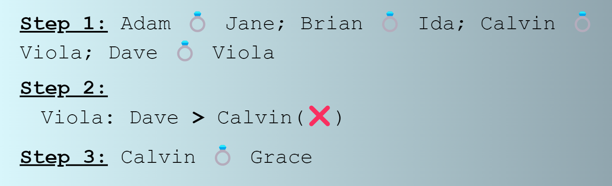

  <h1 align="center">алгоритм Гэйла — Шепли</h1>

<!-- TABLE OF CONTENTS -->

  
Содержание

  <ol>
    <li>
      <a href="#about-the-project">О проекте</a>
    </li>
    <li>
      <a href="#getting-started">Getting Started</a>
    </li>
    <li><a href="#usage">Использование</a></li>
    <li><a href="#contact">Контакты</a></li>
  </ol>

<!-- ABOUT THE PROJECT -->
## О проекте

Web-приложение симулирует работу [алгоритма Гэйла — Шепли](https://ru.wikipedia.org/wiki/%D0%90%D0%BB%D0%B3%D0%BE%D1%80%D0%B8%D1%82%D0%BC_%D0%93%D1%8D%D0%B9%D0%BB%D0%B0_%E2%80%94_%D0%A8%D0%B5%D0%BF%D0%BB%D0%B8), предназначенного для поиска стабильных паросочетаний (мэтчингов).

Всего есть две стороны - предлагающая и принимающая. По умолчанию будем считать, что мужчины делают предложение женщинам, однако в общем случае стороны могут поменяться местами, а также роли могут быть другими - вузы и студенты, например.

-------------
Алгоритм заключается в следующем: каждый мужчина делает предложение первой женщине в своём списке. Каждая женщина отвечает «может быть» своему поклоннику, которого она предпочитает больше всего, и «нет» всем остальным женихам. Затем она временно «обручена» с женихом, которого она до сих пор предпочитает больше всего, и этот жених также временно обручен с ней.

В каждом последующем раунде сначала каждый незанятый мужчина делает предложение наиболее предпочтительной женщине, которой он еще не сделал предложение (независимо от того, обручена ли женщина). Затем каждая женщина отвечает «возможно», если она в настоящее время не помолвлена или если она предпочитает этого мужчину своему нынешнему временному партнеру (в этом случае она отвергает своего нынешнего временного партнера, который становится незанятым). Временный характер помолвки сохраняет право уже обрученной женщины «бросить» своего бывшего партнера.

Этот процесс повторяется до тех пор, пока все не будут задействованы.

--------------------

(<a href="#readme-top">back to top</a>)

<!-- GETTING STARTED -->
## Getting Started
Сборка и развертывание реализованы с использованием `Github pages`: [matching_app](avo-milas.github.io/matching_app/)

(<a href="#readme-top">back to top</a>)

<!-- USAGE EXAMPLES -->
## Использование

Ознакомиться с описанием работы и основных функций можно, нажав на иконку информации на главном меню:

В левой части экрана можно ознакомиться с текстовым описанием работы алгоритма:

В правой части - с визуальным:

(<a href="#readme-top">back to top</a>)

<!-- CONTACT -->
## Контакты

Alina Salimova - [@avo_milas](https://t.me/avo_milas) - avo_milas@mail.ru

Project Link: [https://github.com/avo-milas/matching_app](https://github.com/avo-milas/matching_app)

(<a href="#readme-top">back to top</a>)

